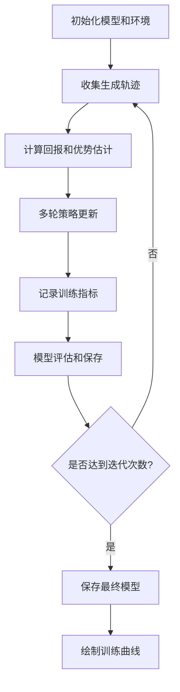
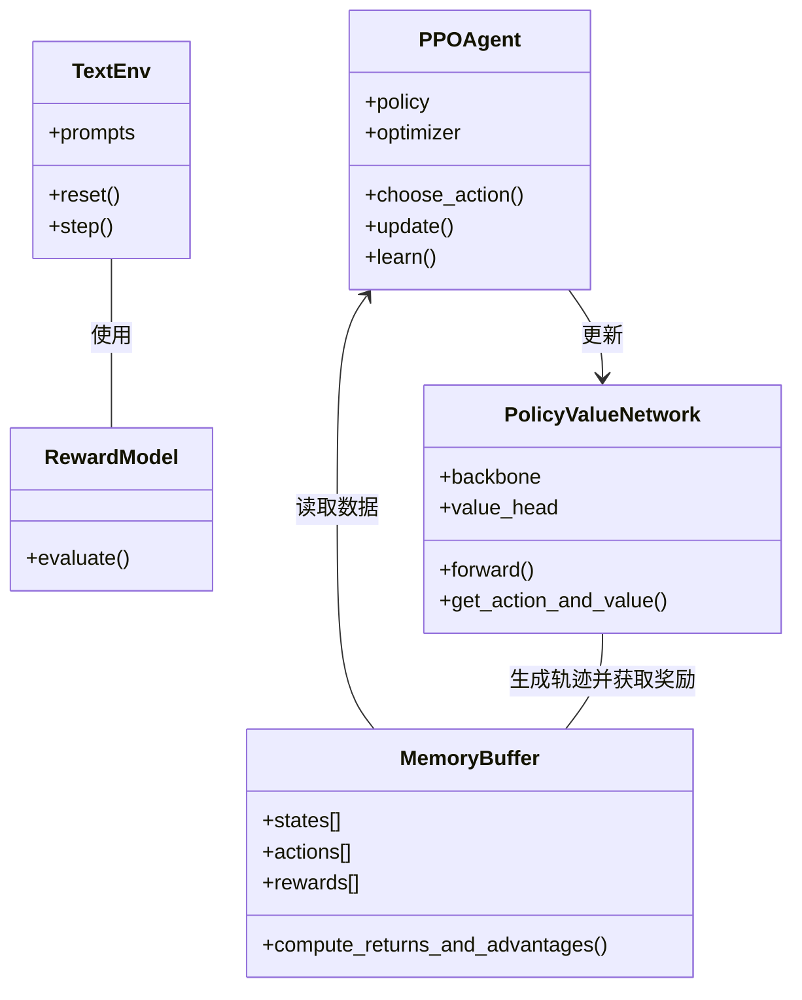

# PPO-Qwen语言模型强化学习训练

本文档详细说明了使用PPO算法对Qwen2.5-0.5B语言模型进行强化学习训练的过程和原理。

## 目录

- [算法概述](#算法概述)
- [执行流程](#执行流程)
- [核心计算过程](#核心计算过程)
- [代码架构](#代码架构)
- [训练配置](#训练配置)
- [注意事项](#注意事项)

## 算法概述

PPO (Proximal Policy Optimization) 是一种流行的策略梯度算法，它通过限制新旧策略之间的差异来实现稳定的策略更新。在语言模型微调中，PPO特别适合用于根据特定的奖励信号来优化模型的生成行为。

### PPO的主要特点

1. **近端策略优化**：使用裁剪目标函数限制策略更新的幅度
2. **Actor-Critic结构**：同时学习策略函数（Actor）和价值函数（Critic）
3. **广义优势估计(GAE)**：提供更好的优势函数估计，减少方差
4. **多轮更新**：每采集一批样本后进行多轮参数更新
5. **KL散度约束**：通过监控KL散度防止策略变化过大

### 在语言模型中的应用

将PPO应用于语言模型的主要步骤：

1. 基于预训练语言模型构建策略网络
2. 定义合适的奖励函数(本项目使用Hugging Face的奖励模型)
3. 收集生成轨迹并计算奖励
4. 使用PPO更新模型参数

## 执行流程

整个训练过程可以概括为以下流程图：



## 核心计算过程

### 1. 广义优势估计(GAE)计算

GAE是一种用于估计优势函数的方法，在PPO中起着至关重要的作用：

```python
def compute_returns_and_advantages(rewards, values, dones, gamma=0.99, gae_lambda=0.95, last_value=0):
    returns = []
    advantages = []
    
    gae = 0
    for i in reversed(range(len(rewards))):
        if i == len(rewards) - 1:
            next_value = last_value
        else:
            next_value = values[i+1]
            
        delta = rewards[i] + gamma * next_value * (1 - dones[i]) - values[i]
        gae = delta + gamma * gae_lambda * (1 - dones[i]) * gae
        
        # 计算回报和优势
        returns.insert(0, gae + values[i])
        advantages.insert(0, gae)
        
    return returns, advantages
```

**公式说明**：
- **时序差分误差(TD error)**: $\delta_t = r_t + \gamma V(s_{t+1}) - V(s_t)$
- **广义优势估计**: $A^{GAE}_t = \sum_{l=0}^{\infty} (\gamma \lambda)^l \delta_{t+l}$
- **折扣回报**: $G_t = A^{GAE}_t + V(s_t)$

### 2. PPO裁剪目标函数

PPO的核心是其裁剪目标函数，它限制了策略更新的幅度：

```python
# 计算比率：new_prob / old_prob
ratio = torch.exp(new_log_probs - old_log_probs)

# 裁剪PPO目标
surrogate1 = ratio * advantages
surrogate2 = torch.clamp(ratio, 1.0 - clip_ratio, 1.0 + clip_ratio) * advantages
policy_loss = -torch.min(surrogate1, surrogate2).mean()
```

**公式说明**：
- **概率比率**: $r_t(\theta) = \frac{\pi_{\theta}(a_t|s_t)}{\pi_{\theta_{old}}(a_t|s_t)}$
- **裁剪目标函数**: $L^{CLIP}(\theta) = \mathbb{E}_t[\min(r_t(\theta)\hat{A}_t, \text{clip}(r_t(\theta), 1-\epsilon, 1+\epsilon)\hat{A}_t)]$

### 3. 总损失函数计算

PPO结合了策略损失、价值损失和熵正则化：

```python
# 价值损失（均方误差）
value_loss = F.mse_loss(values.squeeze(-1), returns)

# 熵损失（用于鼓励探索）
entropy_loss = -entropy.mean()

# 总损失
loss = policy_loss + value_coef * value_loss + entropy_coef * entropy_loss
```

**公式说明**：
- **总损失**: $L^{TOTAL}(\theta) = L^{CLIP}(\theta) - c_1 L^{VF}(\theta) + c_2 S[\pi_{\theta}]$
  - $L^{VF}$: 价值函数损失 (通常是MSE)
  - $S$: 策略的熵
  - $c_1, c_2$: 系数控制各项的重要性

### 4. KL散度早停

为防止策略变化过大，使用近似KL散度来决定是否提前停止更新：

```python
# 计算KL散度（用于早停）
approx_kl = ((old_log_probs - new_log_probs) * ratio).mean().item()

# 如果KL散度过大，提前停止
if approx_kl > target_kl:
    break
```

**公式说明**：
- **近似KL散度**: $D_{KL}(\pi_{\theta_{old}} || \pi_{\theta}) \approx \mathbb{E}_t[(\log \pi_{\theta_{old}}(a_t|s_t) - \log \pi_{\theta}(a_t|s_t)) \cdot r_t(\theta)]$

## 代码架构

本项目的代码包含以下主要组件：

1. **TextEnv**: 文本生成环境，负责与模型交互并计算奖励
2. **PolicyValueNetwork**: 基于Qwen2.5-0.5B构建的策略值网络
3. **MemoryBuffer**: 经验回放缓冲区，存储轨迹数据
4. **PPOAgent**: PPO代理，实现策略更新
5. **主训练循环**: 协调上述组件进行训练

### 类图关系



## 训练配置

本项目使用以下超参数配置：

```python
DEVICE = "cuda" if torch.cuda.is_available() else "cpu"
MAX_LENGTH = 512                # 最大序列长度
BATCH_SIZE = 4                  # 批量大小
EPOCHS = 3                      # 训练轮数
LEARNING_RATE = 1e-5            # 学习率
CLIP_RATIO = 0.2                # PPO裁剪参数
GAMMA = 0.99                    # 折扣因子
GAE_LAMBDA = 0.95               # GAE参数
VALUE_COEF = 0.5                # 价值函数损失系数
ENTROPY_COEF = 0.01             # 熵正则化系数
MAX_GRAD_NORM = 0.5             # 梯度裁剪阈值
UPDATE_EPOCHS = 4               # 每次收集数据后的更新次数
TARGET_KL = 0.01                # KL散度目标阈值
```

## 注意事项

在实际训练中需要注意以下几点：

1. **内存和计算资源**：训练需要较大的GPU内存，尤其是使用较大的语言模型时
2. **奖励设计**：奖励模型的选择对最终效果有显著影响
3. **超参数调整**：可能需要根据具体任务调整超参数
4. **训练稳定性**：监控训练过程中的KL散度，确保策略更新稳定
5. **样本效率**：PPO的样本效率不如某些离线RL算法，可能需要较长的训练时间

## 参考资料

1. PPO原始论文：[Proximal Policy Optimization Algorithms](https://arxiv.org/abs/1707.06347)
2. 大语言模型RLHF：[Training language models to follow instructions with human feedback](https://arxiv.org/abs/2203.02155)
3. 广义优势估计：[High-Dimensional Continuous Control Using Generalized Advantage Estimation](https://arxiv.org/abs/1506.02438) 