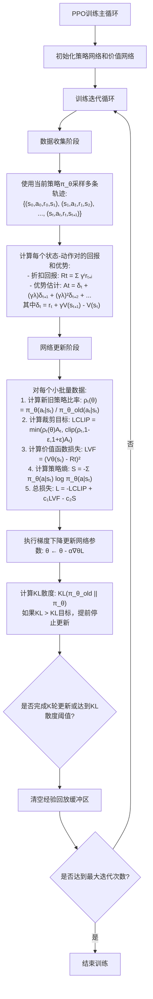
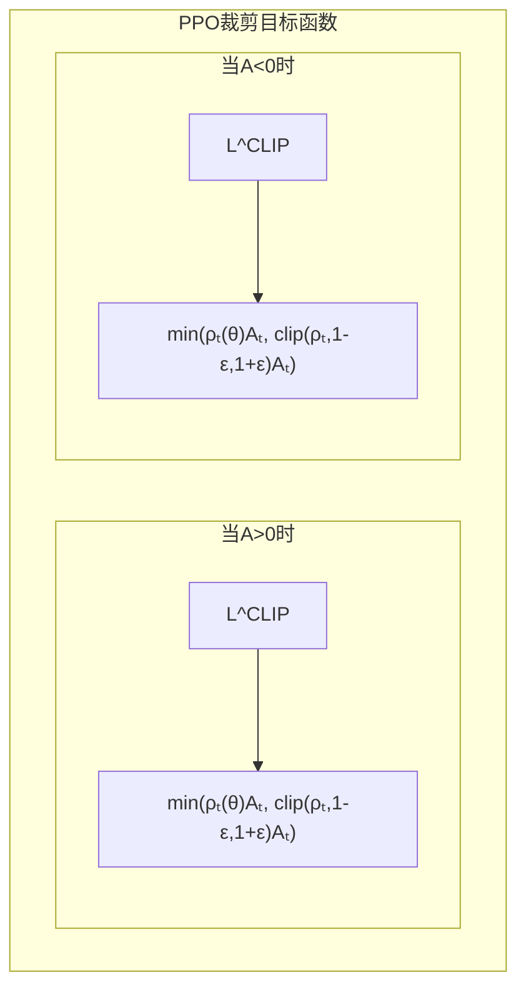
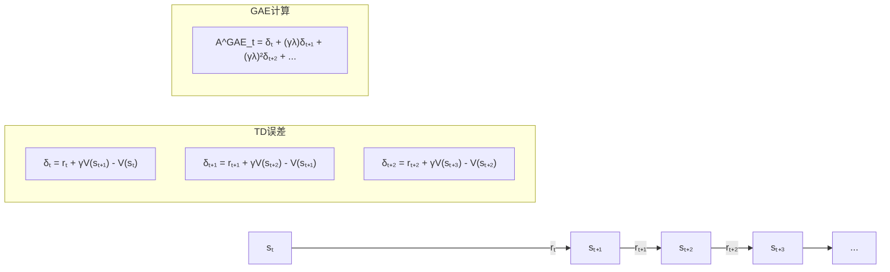
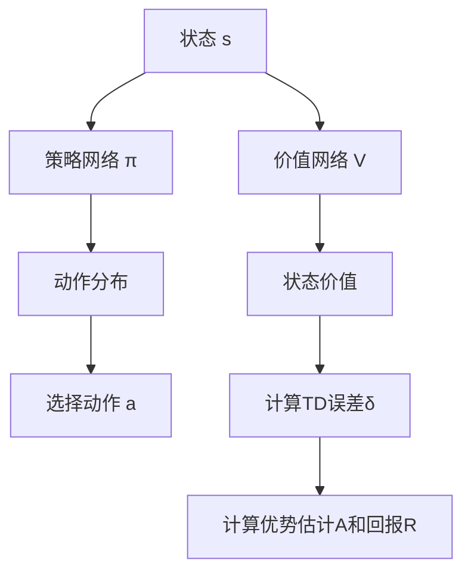
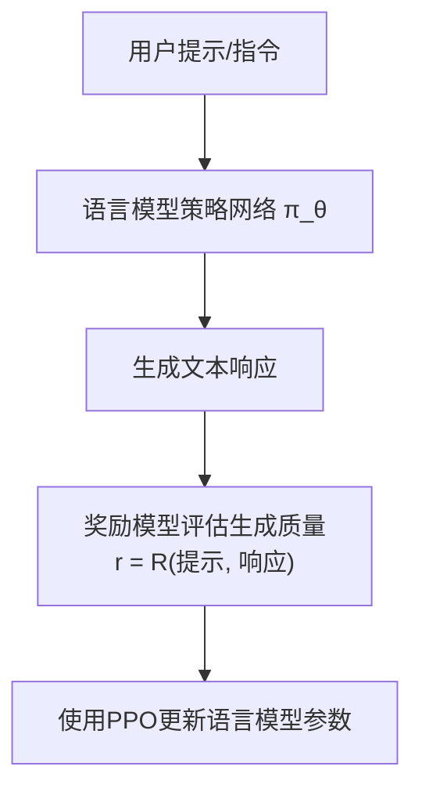

# PPO算法详细流程与原理图解

## PPO算法流程图



## PPO核心组件图解

### 1. PPO的裁剪目标函数

PPO通过裁剪目标函数来限制策略更新的幅度，避免过大的策略变化：



关键特点:
- 当优势A>0（表示该动作比平均表现更好）时：
  - 如果ρ(θ) > 1+ε，则目标值被裁剪，防止策略过度更新
  - 如果1-ε < ρ(θ) < 1+ε，则目标值正比于ρ(θ)
- 当优势A<0（表示该动作比平均表现更差）时：
  - 如果ρ(θ) < 1-ε，则目标值被裁剪
  - 如果1-ε < ρ(θ) < 1+ε，则目标值反比于ρ(θ)

### 2. 广义优势估计(GAE)计算

GAE通过结合多步时序差分(TD)误差来提供更好的优势估计：



GAE通过λ参数平衡了方差和偏差：
- 当λ=0时，相当于单步TD估计，低方差但高偏差
- 当λ=1时，相当于Monte-Carlo估计，高方差但无偏差
- 0<λ<1时，在二者之间取得平衡

### 3. Actor-Critic架构

PPO使用Actor-Critic架构，同时优化策略和价值函数：



### 4. 在语言模型中的PPO流程

将PPO应用于语言模型强化学习的特殊流程：



## 理论基础

### PPO的数学原理

PPO算法的核心公式包括：

1. **目标函数**:
   L^CLIP(θ) = 𝔼[min(ρ_t(θ)A_t, clip(ρ_t(θ), 1-ε, 1+ε)A_t)]
   
   其中:
   - ρ_t(θ) = π_θ(a_t|s_t) / π_θ_old(a_t|s_t) 是新旧策略的概率比
   - A_t 是优势函数估计值
   - ε 是裁剪参数（通常设为0.2）

2. **总体目标函数**:
   L^TOTAL(θ) = 𝔼[L^CLIP(θ) - c_1 L^VF(θ) + c_2 S[π_θ(s_t)]]
   
   其中:
   - L^VF(θ) = (V_θ(s_t) - R_t)^2 是价值函数损失
   - S[π_θ(s_t)] = -∑_a π_θ(a|s_t) log π_θ(a|s_t) 是策略的熵
   - c_1, c_2 是权重系数

3. **广义优势估计**:
   A_t^GAE(γ,λ) = ∑_(l=0)^∞ (γλ)^l δ_{t+l}
   
   其中:
   - δ_t = r_t + γV(s_{t+1}) - V(s_t) 是TD残差
   - γ 是折扣因子
   - λ 是GAE参数

## PPO算法与标准RL算法的比较

| 特点            | REINFORCE | A2C/A3C      | TRPO           | PPO                  |
|----------------|-----------|--------------|----------------|----------------------|
| 样本效率        | 低        | 中           | 中-高          | 中-高                |
| 计算复杂度      | 低        | 中           | 高            | 中                   |
| 稳定性          | 低        | 中           | 高            | 高                   |
| 超参数敏感度    | 高        | 中           | 低            | 低                   |
| 目标函数        | 策略梯度   | Actor-Critic | KL约束策略优化 | 裁剪目标策略优化      |
| 并行训练支持    | 差        | 优           | 可            | 优                   |
| 实现复杂度      | 低        | 中           | 高            | 中                   |
```